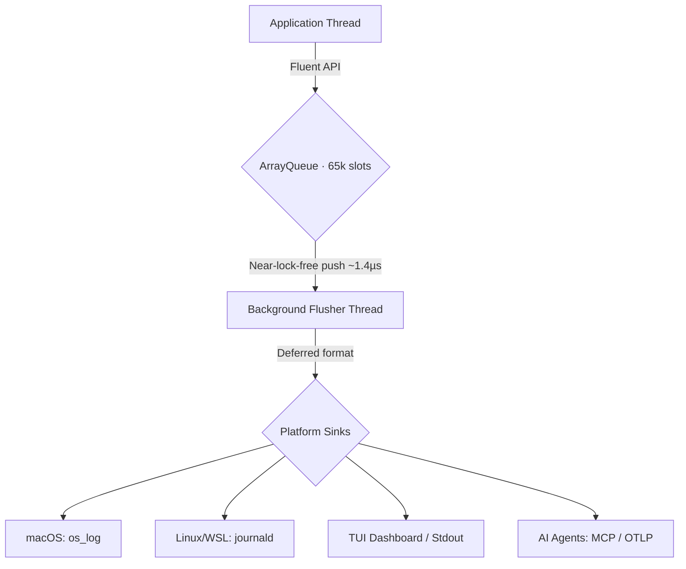

<p align="center">
  
</p>

<h1 align="center">RustLogs (RLG)</h1>

<p align="center">
  <strong>Near-lock-free structured logging with deferred formatting, native OS sinks, and AI-native telemetry. Sub-microsecond ingestion. Zero blocking I/O on your threads.</strong>
</p>

<p align="center">
  <a href="https://github.com/sebastienrousseau/rlg/actions">
    
  </a>
  <a href="https://crates.io/crates/rlg">
    
  </a>
  <a href="https://docs.rs/rlg">
    
  </a>
  <a href="https://codecov.io/gh/sebastienrousseau/rlg">
    
  </a>
</p>

---

## Overview

RLG decouples log emission from formatting and I/O using a near-lock-free ring buffer ([LMAX Disruptor](https://lmax-exchange.github.io/disruptor/) pattern). Your application threads push events in ~1.4 µs. A dedicated flusher thread handles serialization and platform-native dispatch.

**Key properties:**

- **~1.4 µs ingestion** via a 65k-slot `crossbeam::ArrayQueue` — no Mutex on the hot path
- **Deferred formatting** — serialization happens on the flusher thread, not yours
- **14 output formats** — JSON, MCP, OTLP, ECS, CEF, GELF, Logfmt, CLF, and more
- **Native OS sinks** — direct `os_log` (macOS) and `journald` (Linux) FFI
- **MIRI-verified** — zero undefined behaviour under strict provenance checks

### How RLG Compares

| Metric | `tracing` / `log` | RLG |
| :--- | :--- | :--- |
| **Ingestion latency** | ~20–30 µs (Mutex) | **~1.4 µs (atomic-only)** |
| **Serialization** | Inline, high-alloc | **Deferred, low-alloc** |
| **OS integration** | stdout / files | **`os_log` + `journald` FFI** |
| **AI formats** | Requires adapters | **Native MCP + OTLP** |
| **Safety** | Standard Rust | **MIRI-compliant** |

## Architecture



## Getting Started

### Requirements

- Rust **1.88.0+** (`rustc --version`)
- Cargo package manager

### Install

```bash
cargo add rlg@0.0.7
```

### Initialize

Call `rlg::init()` at the top of `main`. Hold the returned [`FlushGuard`](https://docs.rs/rlg/latest/rlg/init/struct.FlushGuard.html) — it flushes pending events when dropped.

```rust
fn main() {
    let _guard = rlg::init().unwrap();

    rlg::log::Log::info("Service started")
        .component("main")
        .fire();
}
```

**Returns `Err`** if a `log` or `tracing` global was already registered, or if `init()` was already called.

For custom configuration, use the builder:

```rust
let _guard = rlg::builder()
    .level(rlg::LogLevel::DEBUG)
    .format(rlg::LogFormat::JSON)
    .init()
    .unwrap();
```

## The Fluent API

Build structured log entries with a chainable builder. Each method returns `Self`, so chain freely.

| Method | Effect |
| :--- | :--- |
| `Log::info("…")` | Create a builder at INFO level. Also: `warn`, `error`, `debug`, `trace`, `fatal`, `critical`, `verbose`. |
| `.component("name")` | Tag the originating service or module. |
| `.with("key", value)` | Attach a key-value attribute. Accepts any `T: Serialize`. |
| `.format(LogFormat::X)` | Override the output format for this entry. |
| `.fire()` | Consume the builder and push into the ring buffer. Captures `file:line` via `#[track_caller]`. |

### Example

```rust
use rlg::log::Log;
use rlg::log_format::LogFormat;

Log::info("Instance scaled")
    .component("orchestrator")
    .with("cpu_load", 0.85)
    .with("region", "us-east-1")
    .format(LogFormat::OTLP)
    .fire();
```

## Features

Enable optional capabilities via Cargo features. **No features are enabled by default.**

| Feature | Description |
| :--- | :--- |
| `tokio` | Async config loading, hot-reload file watcher (`notify`). |
| `tui` | Terminal UI dashboard with live metrics (`terminal_size`). |
| `miette` | Pretty diagnostic error reports. |
| `tracing-layer` | Composable `tracing_subscriber::Layer` via `RlgLayer`. |
| `debug_enabled` | Verbose internal engine diagnostics. |

```toml
[dependencies]
rlg = { version = "0.0.7", features = ["tokio", "tui"] }
```

<details>
<summary><b>Performance and Sinks</b></summary>

- **Ring buffer**: Crossbeam `ArrayQueue` with 65,536 slots.
- **Low-alloc serialization**: `u64` session IDs, `Cow<str>` fields, `itoa`/`ryu` for numerics.
- **Platform FFI**: Direct `os_log` (macOS) and `journald` socket (Linux). Falls back to stdout when unavailable.
- **Log rotation**: Size, time, date, or count-based policies via `RotatingFile`.
</details>

<details>
<summary><b>Supported Formats</b></summary>

- **MCP** — JSON-RPC 2.0 notifications for AI agent orchestration.
- **OTLP** — OpenTelemetry-native for distributed tracing pipelines.
- **ECS** — Elastic Common Schema for security and compliance.
- **Logfmt** — Human-readable key-value pairs.
- **JSON / NDJSON** — Standard structured output.
- **Legacy** — CLF, CEF, GELF, W3C, Apache Access, Logstash, Log4j XML, ELF.
</details>

<details>
<summary><b>Safety and Compliance</b></summary>

- **MIRI-verified**: Passes strict provenance, aliasing, and UB checks.
- **95%+ code coverage** across all modules.
- **Pedantic linting**: `#![deny(clippy::all, clippy::pedantic, clippy::nursery)]`.
- **Graceful fallback**: Degrades to stdout if native sinks are unavailable.
</details>

---

<p align="center">
  THE ARCHITECT ᛫ <a href="https://sebastien.sh">Sebastien Rousseau</a><br/>
  THE ENGINE ᛞ <a href="https://euxis.com">EUXIS</a> ᛫ Enterprise Unified Execution Intelligence System
</p>

## License

Dual-licensed under [MIT](LICENSE-MIT) or [Apache-2.0](LICENSE-APACHE), at your option.

<p align="right"><a href="#rustlogs-rlg">↑ Back to Top</a></p>
