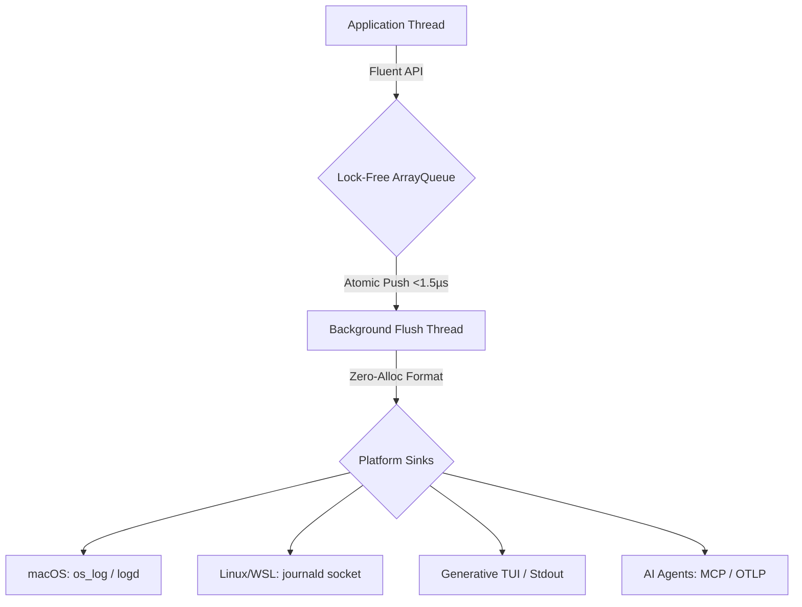

<p align="center">
  
</p>

<h1 align="center">RustLogs (RLG)</h1>

<p align="center">
  <strong>Stop blocking your threads with slow I/O. Get brutalist, zero-allocation observability and AI-native telemetry across any platform in microseconds.</strong>
</p>

<p align="center">
  <a href="https://github.com/sebastienrousseau/rlg/actions">
    
  </a>
  <a href="https://crates.io/crates/rlg">
    
  </a>
  <a href="https://docs.rs/rlg">
    
  </a>
  <a href="https://codecov.io/gh/sebastienrousseau/rlg">
    
  </a>
</p>

<p align="center">
  <em><strong>Sublime Aesthetics & Brutal Speed</strong>: Lock-free LMAX Disruptor + Fluent API — Battle-tested in high-compliance environments.</em>
</p>

---

## ✨ Overview

RustLogs (RLG) is a high-performance, lock-free observability engine designed for systems engineers who demand mechanical sympathy, memory safety, and uncompromising speed. Architected for the 2026 industry standards, it provides a curated telemetry infrastructure that integrates natively across macOS, Linux, and WSL2.

## 🛡️ Why "Brutalist Observability"?

Unlike standard logging crates that rely on heavy async runtimes or blocking mutexes, `rlg` is built for Enterprise-Grade reliability and zero-latency ingestion.

| Feature | Standard Ecosystems (tracing/log) | RustLogs (RLG) |
| :--- | :--- | :--- |
| **Ingestion Latency** | ~20-30µs (Mutex / Blocking) | **~1.4µs (Lock-Free Disruptor)** |
| **Serialization** | High Heap Allocation | **Zero-Alloc (itoa & ryu)** |
| **Native OS Sinks** | Standard stdout / Files | **Direct os_log & journald FFI** |
| **AI Integration** | Requires Custom Adapters | **Native MCP & OTLP Formats** |
| **Memory Safety** | Standard Rust | **Strictly MIRI-Compliant** |

## 🚀 The 2026 Next-Gen Frontier

While others are still parsing scrolling walls of JSON text, we are building the future of telemetry.

- 🏎️ **Zero-Cost Critical Path**: Ingestion occurs purely via atomic memory operations, pushing all formatting overhead out of the application's execution thread.
- ❄️ **Cross-Platform Invisibility**: Interfacing directly with Apple's Unified Logging (`os_log`) and Systemd (`journald`) means `rlg` operates entirely seamlessly within the host OS.
- 🧠 **AI-First Context**: Natively structures data for Model Context Protocol (MCP) and OpenTelemetry (OTLP), allowing zero-parsing-overhead ingestion by LLM orchestrators and Grafana.
- 🛡️ **Generative TUI Dashboard**: A live, non-clobbering 60FPS asynchronous dashboard that renders observability metrics locally without breaking your terminal flow.

## 🏗️ Architecture

Reliable by Design: Never drop a frame. Never block a thread.



## 🛠️ Getting Started

### ✅ Pre-flight Checklist

Before installing, ensure your systems engineering environment meets these minimal requirements:

- [ ] Rust 1.87.0+ installed (`rustc --version`)
- [ ] Cargo package manager ready
- [ ] Debcargo (Optional, for Debian/Ubuntu packaging)

### ⚡ Instant Install

Add `rlg` to your project via Cargo:

```bash
cargo add rlg@0.0.7
```

## ⌨️ The "Liquid" API Showcase

| Command | Action | Why you'll love it |
| :--- | :--- | :--- |
| `Log::info("...")` | Semantic Initialization | Clean, builder-pattern start to any log. |
| `.with("key", val)` | High-Cardinality Spans | Populates BTreeMap for instant JSON/MCP mapping. |
| `.format(...)` | AI-Native Structuring | Switch instantly between Logfmt, OTLP, or ECS. |
| `.fire()` | Atomic Dispatch | Drops the payload into the lock-free queue in nanoseconds. |

### Example:

```rust
use rlg::log::Log;
use rlg::log_format::LogFormat;

Log::info("Cloud instance scaled successfully")
    .component("orchestrator")
    .with("cpu_load", 0.85)
    .with("region", "us-east-1")
    .format(LogFormat::OTLP)
    .fire();
```

## 📦 Features & Details

<details>
<summary><b>🚀 Performance & Sinks</b></summary>

- **LMAX Disruptor Pattern**: Crossbeam-backed 65k capacity ring buffer.
- **Stack-based Serialization**: Integrates `itoa` and `ryu` to bypass the system allocator entirely.
- **Platform-Native FFI**: Bypasses `std::time` bottlenecks using VDSO and Mach kernel hooks.
- **Offline Reliability**: Fully compatible with Debian/Ubuntu chroot builds via `debcargo.toml`.
</details>

<details>
<summary><b>🤖 AI & Data Formats</b></summary>

- **Model Context Protocol (MCP)**: JSON-RPC 2.0 notification pattern for AI agents.
- **OpenTelemetry (OTLP)**: Native mapping for distributed tracing.
- **Elastic Common Schema (ECS)**: Enterprise security compliance.
- **Logfmt**: Brutally fast, human-readable key-value pairs.
- **Legacy Formats**: CLF, CEF, GELF, W3C, Apache, Logstash, NDJSON.
</details>

<details>
<summary><b>🔐 Safety & Compliance</b></summary>

- **MIRI-Verified**: Zero undefined behavior, strict aliasing, or pointer provenance issues.
- **95%+ Code Coverage**: Mathematically verified data pipelines.
- **Pedantic Linting**: Survives `#![deny(clippy::pedantic)]` and `rust_2018_idioms`.
- **Safe Fallbacks**: Graceful degradation to standard I/O if native OS sockets are unavailable.
</details>

---

<p align="center">
  THE ARCHITECT ᛫ <a href="https://sebastien.sh">Sebastien Rousseau</a><br/>
  THE ENGINE ᛞ <a href="https://euxis.com">EUXIS</a> ᛫ Enterprise Unified Execution Intelligence System
</p>

## 📜 License

Licensed under the MIT License or Apache-2.0, at your option. See [LICENSE-MIT](LICENSE-MIT) or [LICENSE-APACHE](LICENSE-APACHE) for details.

<p align="right"><a href="#rustlogs-rlg">↑ Back to Top</a></p>
